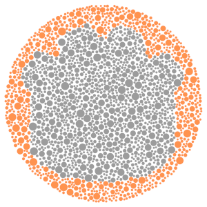

# godot-colorblindness

A colorblindness simulator to help you design for everyone.

The color calculations I use are heavily based on:
* [Color Blindness Simulation Research](https://ixora.io/projects/colorblindness/color-blindness-simulation-research/)
* [Digital Video Colourmaps for Checking the Legibility of Displays by Dichromats](http://vision.psychol.cam.ac.uk/jdmollon/papers/colourmaps.pdf)
* [This page on color space transformation matrixes](http://www.brucelindbloom.com/index.html?WorkingSpaceInfo.html)
* [The wikipedia page on sRGB](https://en.wikipedia.org/wiki/SRGB)

The Godot Ishihara plate has been generated with [this tool](https://franciscouzo.github.io/ishihara/).

# Usage

- Install the plugin through Godot's AssetLib
- Activate it from the Plugin menu (`AssetLib` => `Plugins` button)
- This adds a new control called `Colorblindness` under `ColorRect`. 
- Create a new `CanvasLayer` and add a `Colorblindness` control to it in your scene.
- Specify the `Type` property (eg. `Deuteranopia`)

Everything that renders under the control will appear tinted to match your selected color-blindness mode.

# Sample

The following sample shows normal vision, Protanopia, Deuteranopia, and Tritanopia (in that order).

Normal vision

Protanopia

Deuteranopia

Tritanopia

